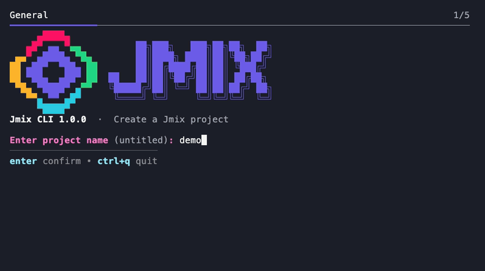

# Jmix CLI

[](https://github.com/jmix-framework/jmix-cli/actions/workflows/ci.yml)
[](LICENSE)

Create [Jmix](https://www.jmix.io/) projects with an interactive wizard or from
scripts and AI agents, using the same project templates as Jmix Studio.

<p align="center">
  
</p>

## Install

**macOS / Linux**

```shell
curl -fsSL https://github.com/jmix-framework/jmix-cli/releases/latest/download/install.sh | bash
```

**Windows (PowerShell)**

```powershell
irm https://github.com/jmix-framework/jmix-cli/releases/latest/download/install.ps1 | iex
```

The installer starts the wizard. The CLI bundles its own Java runtime;
building generated projects needs a compatible JDK, which the wizard can help install.

## Create a project

```shell
jmix
```

Choose a template, languages, add-ons, and project location. Follow the keyboard
hints at the bottom of each step. In text input, use **Ctrl+Q** to quit.

The progress bar tracks General, Localization, Add-ons, Location and Git, and Finishing up.

The add-on picker groups compatible **free add-ons** by purpose. Press **/** to search,
**Space** to toggle, and **Enter** to confirm. Add-ons supplied by the template
are omitted; matching translations are preselected and can be unchecked.
In line-input consoles, use `/query` and comma-separated selection numbers.

For scripts and AI agents, pass `--non-interactive`:

```shell
jmix new demo --non-interactive \
    --template application \
    --locales en,de \
    --addons quartz,german-translation

cd demo
./gradlew bootRun
```

Non-interactive mode creates `./<name>` and installs no additional add-ons unless
`--addons` is supplied. Use `--path` for another location or `--no-git` to skip
Git initialization. On Windows, run `gradlew.bat bootRun`.

Generated projects include [Jmix Agent Toolkit](https://github.com/jmix-framework/jmix-agent-toolkit)
guidelines and skills for supported AI coding assistants.

## Options and updates

```shell
jmix new --help          # all project options
jmix update              # update the installed CLI
jmix --no-update new     # skip the startup update check
```

Installed builds check for updates automatically. Set `JMIX_CLI_NO_AUTO_UPDATE=1`
to disable checks; they are also skipped when `CI` is set or running from source.

Templates and the add-on catalog are cached under `~/.jmix/`. Offline use requires
cached templates and, when installing add-ons, the relevant Gradle dependencies.
Use `--repository` to select a custom template repository.

## Development

JDK 17+ is needed to launch Gradle; the build provisions its JDK 25 toolchain.

```shell
git clone https://github.com/jmix-framework/jmix-cli.git
cd jmix-cli
./run.sh                          # launch from source on macOS/Linux
./gradlew build                   # build and test
JMIX_CLI_IT=true ./gradlew test   # network-backed integration tests
```

- [Contributor guide](AGENTS.md) — conventions, feature docs, and verification.
- [Distribution guide](docs/DISTRIBUTION.md) — platform bundles and releases.
- [Demo recording](docs/demo.tape) — reproduce the README GIF with VHS.

## License

[Apache License 2.0](LICENSE).
